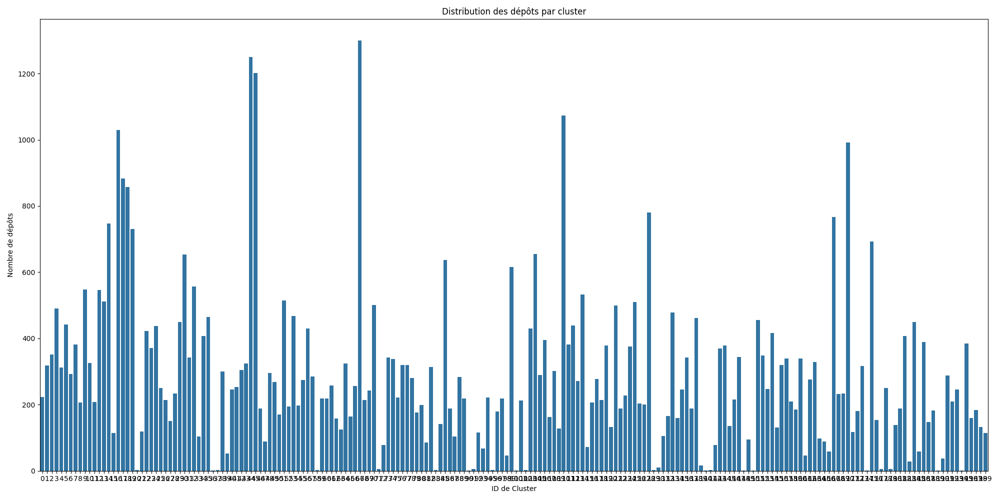
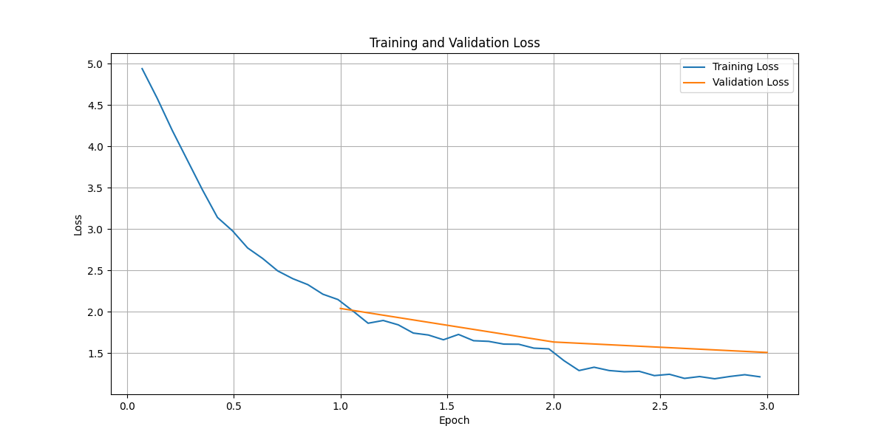

# Rapport de Projet IA : Classification de Dépôts GitHub

---

## Introduction

L'objectif de ce projet est de développer un système capable de classifier automatiquement des dépôts GitHub dans des catégories pertinentes. Face à des millions de projets, une telle classification permettrait d'améliorer les systèmes de recommandation, l'analyse de tendances et la recherche.

Pour relever ce défi, nous avons développé un pipeline en deux temps. D'abord, une phase de **clustering non supervisé** pour découvrir des catégories sémantiques à partir des descriptions et des `README.md` des dépôts. Ensuite, une phase de **classification supervisée** où un modèle de langage (Transformer) est entraîné à prédire ces catégories, transformant notre découverte en un outil de prédiction robuste.

Ce rapport détaille la méthodologie, l'architecture du pipeline de production sur SLURM, et les résultats obtenus.

---

## I. Jeu de Données et Collecte

La base de notre analyse est un fichier `github_data_with_readmes.csv`, généré à partir de notebooks de scraping (`scrapIntoOneRepo.ipynb`) qui interrogent l'API GitHub.

* **Source initiale** : Une liste de dépôts ayant plus de 1000 étoiles (`repos-min-1000stars.json`).
* **Données collectées** : Pour chaque dépôt, nous avons extrait les métadonnées (langage, étoiles) ainsi que le contenu textuel crucial : `description` et `readme_content`.
* **Nettoyage** : Les dépôts sans contenu textuel ou avec des `README` trop courts ont été filtrés. Le jeu de données final pour l'entraînement contient **56 641 dépôts**.

---

## II. Architecture du Pipeline

La migration de Jupyter vers un pipeline SLURM a été motivée par le besoin de reproductibilité et de gestion de la mémoire.

### Étape 1 : Clustering Non-Supervisé (`step1_create_categories.py`)

Cette étape vise à répondre à la question : "Quels sont les N thèmes principaux dans nos données ?"

1.  **Lecture par Chunks** : Le CSV (de plusieurs Go) est lu par morceaux de 2000 lignes pour ne jamais saturer la RAM.
2.  **Vectorisation (Embeddings)** : Pour chaque dépôt, le texte (`description` + `readme_content`) est converti en vecteur sémantique à l'aide de `sentence-transformers/all-MiniLM-L6-v2` sur le GPU.
3.  **Clustering** : Un modèle `MiniBatchKMeans` (paramétré pour 200 clusters) est entraîné de manière incrémentale sur ces vecteurs.
4.  **Nommage des Clusters** : Une fois les clusters formés, une analyse `TF-IDF` est effectuée sur le contenu textuel de chaque cluster pour extraire les 5 mots-clés les plus représentatifs (ex: "Cluster 42 - python, django, web, api, rest").
5.  **Sortie** : Le script génère `github_categories_database.json`, qui associe chaque ID de cluster (0-199) à un nom et à son "vecteur prototype" (le centre du cluster).

### Étape 2 : Classification Supervisée (`step2_train_classifier.py`)

Cette étape transforme les 200 clusters découverts en 200 "labels" pour un entraînement supervisé.

1.  **Création des Labels** : Le script relit le CSV. Pour chaque dépôt, il génère son embedding et trouve le cluster le plus proche (via similarité cosinus avec les prototypes). L'ID de ce cluster devient son "étiquette" (label).
2.  **Stratification** : Le jeu de données est divisé en `train` (80%) et `test` (20%) en s'assurant que la proportion de chaque catégorie est préservée (`stratify_by_column="label"`).
3.  **Fine-Tuning** : Un modèle `distilroberta-base` est chargé et "fine-tuné" sur le jeu d'entraînement. Nous utilisons des optimisations de mémoire (lots de 4, accumulation de gradient, `optim="adamw_8bit"`) pour garantir que l'entraînement s'exécute sur un seul GPU.
4.  **Évaluation** : Le modèle final est évalué sur le jeu de test.
5.  **Sortie** : Le script sauvegarde le modèle, un rapport de classification et les graphiques de performance.

---

## III. Difficultés Rencontrées et Solutions La migration vers SLURM a présenté plusieurs défis techniques qui ont été résolus méthodiquement :

* **Environnement SLURM** : Les jobs SLURM s'exécutent dans un environnement minimal. Les erreurs `module: commande introuvable` et `uv: commande introuvable` ont été résolues en utilisant le chemin absolu (`/home/lcoussy/.local/bin/uv`) et en adoptant le workflow `uv venv` -> `uv pip sync` -> `uv run`.
* **Gestion des Données (Git LFS)** : La `KeyError: 'description'` initiale était due au fait que `git-lfs` n'avait pas téléchargé le CSV sur le nœud de calcul. La solution a été d'exécuter `git lfs pull` avant de lancer le pipeline.
* **Limites de Python** : Une erreur `_csv.Error: field larger than field limit` est survenue car certains `README.md` dépassaient 128Ko. La solution a été d'augmenter la limite avec `csv.field_size_limit()`.
* **Dépendances Python** : `pandas` nécessitait des dépendances implicites (`pytz`, `python-dateutil`, `six`) qui ont dû être ajoutées manuellement à `requirements.txt`.
* **Logique de Script** : Plusieurs `NameError` et `TypeError` (comme `evaluation_strategy` vs `eval_strategy`) ont été corrigés, ainsi qu'une `ValueError` de `scikit-learn` (199 classes vs 200 noms) due à la stratification.

---

## IV. Résultats et Discussion

*(Cette section est à remplir avec les artefacts générés dans votre dossier `/outputs` une fois le pipeline terminé)*

### Distribution des Clusters (Étape 1)

Ici, collez l'image `outputs/step1_clustering/cluster_distribution.png`.



*Analyse : *

### Performance de l'Entraînement (Étape 2)

Ici, collez l'image `outputs/step2_classification/training_plots.png`.



*Analyse : *

### Rapport de Classification (Étape 2)

Ici, collez le contenu du fichier `outputs/step2_classification/classification_report.txt`.


```
precision    recall  f1-score   support
...
    accuracy                           0.XX     11329
   macro avg       0.XX      0.XX      0.XX     11329
weighted avg       0.XX      0.XX      0.XX     11329
```

*Analyse : *

### Matrice de Confusion (Étape 2)

*(Note : avec 200 catégories, cette image sera illisible. Vous pouvez soit ne pas la mettre, soit zoomer sur un carré intéressant).*


---

## V. Conclusion

*(Résumez le succès du projet. Le classifieur est-il performant ? Quelles seraient les prochaines étapes ? (Utiliser un modèle plus grand comme RoBERTa-large ? Ajouter plus de données ? Nettoyer le texte plus en profondeur ?))*